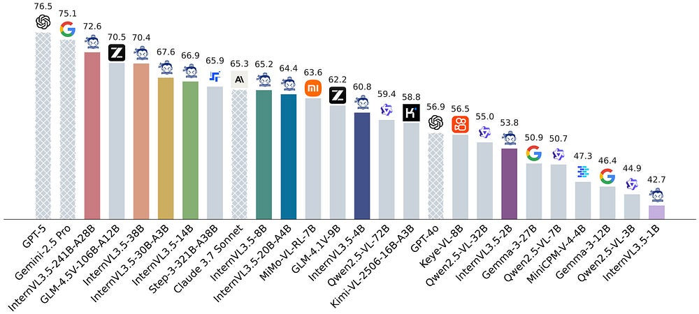
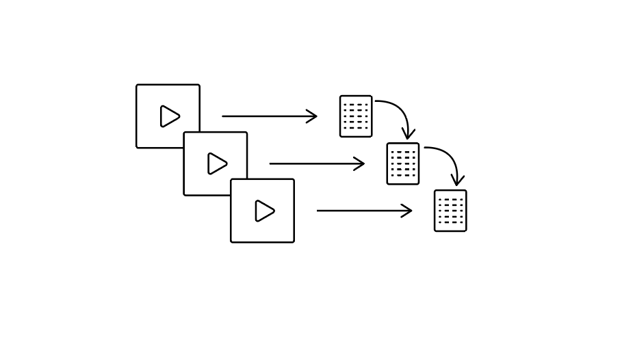

# Hacking the context window with InterVL 3.5 

Whether you are just getting started generating descriptions of visuals with multimodal large language models or exploring open-weight alternatives to proprietary APIs, OpenGVLab's InternVL 3.5 is a great place to start. It is powerful, free, and can run on private machines. According to its documentation, the biggest version of the model, sporting 241-billion-parameters, scores highly on benchmarks, narrowing that gap with proprietary MLLMs such as Gemini and ChatGPT.

So what's the catch? InternVL 3.5 only has a 32K-token context window compared to proprietary models which can handle millions. This means you are limited to less frames per prompt, and risk losing details for videos longer than 1–2 minutes. 

Luckily, there's a straightforward way to handle longer videos: chain-of-context prompting. You split the video into clips and feed the description of each previous clip as context for the next one, building a cumulative description across the full video.

The notebook is based on the documentation, with changes to allow loading a quantized model and the context prompting. 